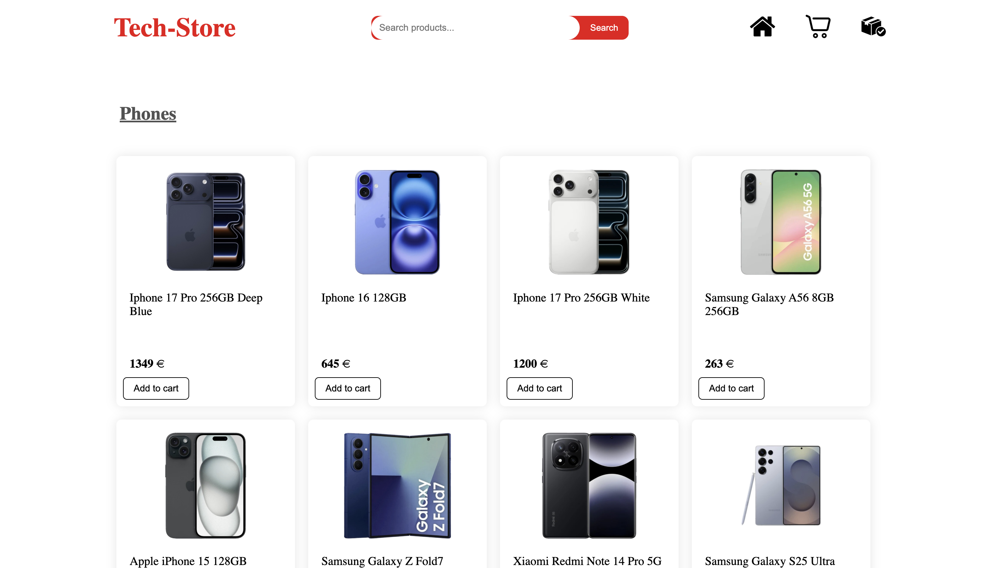
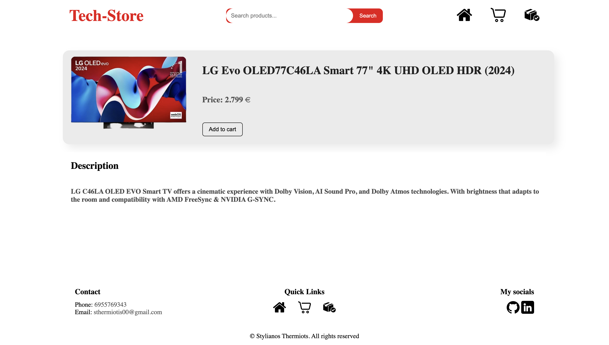
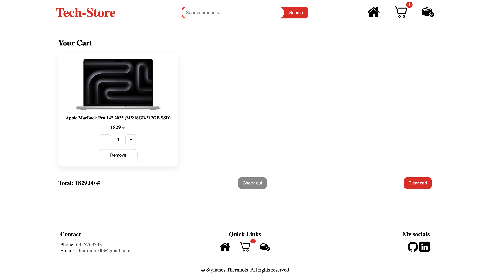
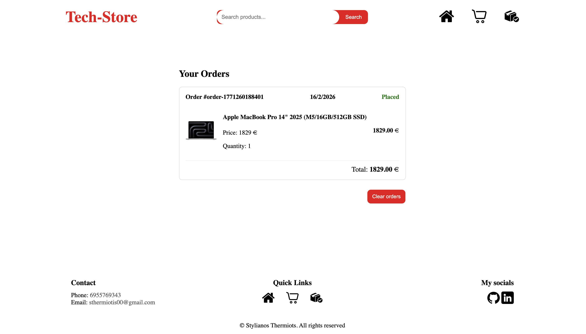
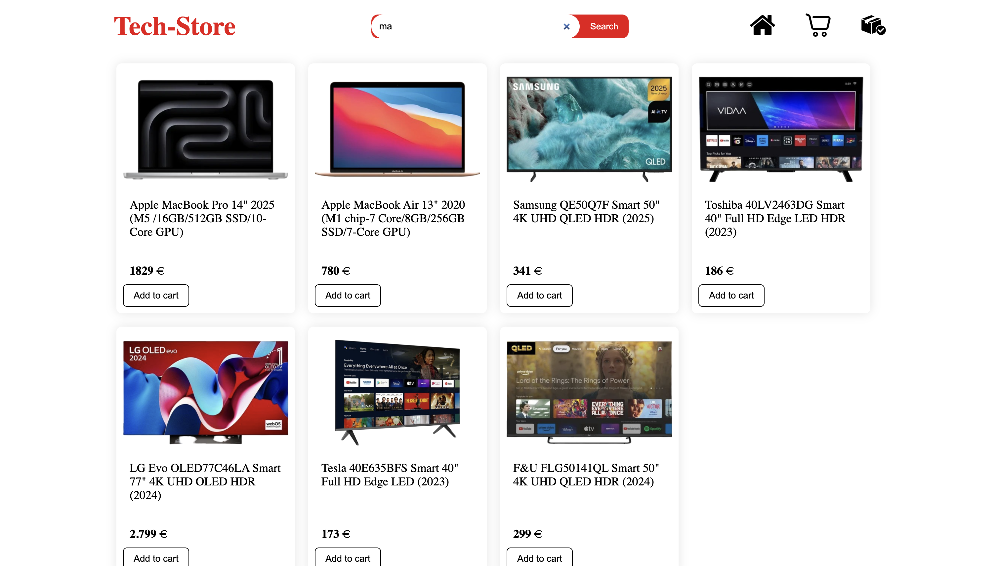

# Tech Store — Modern E-Commerce Frontend

This is a modern Single Page Application (SPA) built with React, simulating a comprehensive tech-focused e-commerce experience.

---

## Key Features

* **Dynamic Search:** Real-time product filtering and search functionality.
* **Advanced Cart:** Full cart management including adding/removing items and automatic quantity updates.
* **Data Persistence:** Persistent storage for cart items and order history using the browser's localStorage.
* **Responsive Design:** Optimized for mobile, tablet, and desktop displays.
* **State Management:** Centralized state handling using React Context API.

---

## Tech Stack

| Technology | Usage |
| :--- | :--- |
| React | UI Library |
| Context API | State Management |
| React Router | Client-side Routing |
| CSS Modules | Component Styling |
| Local JSON | Mock Database |

---

## Screenshots

### Home Page


### Product


### Product Details


### Shopping Cart


### Order History


### Search


---

## Installation and Setup

Follow these steps to run the project locally:

1. **Clone the repository:**
   ```bash
   git clone <repository-url>
   cd Tech-Store-Eshop
2. **Install dependencies:**
    ```bash
    npm install
3.  **Start the development server:**
    ```bash
    npm start
4.  **Access the application:**
    The application will be available at http://localhost:3000

---

## Project Structure

* `src/context`: Global state management logic.
* `src/components`: Reusable UI components.
* `src/pages`: Main application views (Home, Cart, Orders).
* `public/assets`: Product images and documentation screenshots.


    